# MmgGameApiJava
A Java based 2D game API. Build an entire game right in your IDE in Java. Almost fully compatible at the code level, library code, with the C# version of the game API.

## Errata
Input key repeat fix for Mac OSX. Prevents keyboard input freeze due to keyboard press and hold.
<pre>
defaults write -g ApplePressAndHoldEnabled -bool false
</pre>

## Detailed Explantion of the API
A detailed explanation of the API can be found in this book.
 
 
[*Introduction to Video Game Engine Development*](https://github.com/Apress/introduction-video-game-engine-development)

## Games that Use The API
You can find the mot advanced game that uses the API here:
 
 
[Tyre](https://github.com/vbrusca/MmgGameApi-TyreSK)
 
 
This is a port of a T-Mobile SideKick game to the API. It is very easy to convert old T-Mobile SideKick games to this API and this project serves as an example.
There are also compatible games in this book repo:
 
 
[*Introduction to Java Through Game Development*](https://github.com/Apress/introduction-to-java-through-gamedev)

## Sample Game Screen Shots

### Dungeon Trap
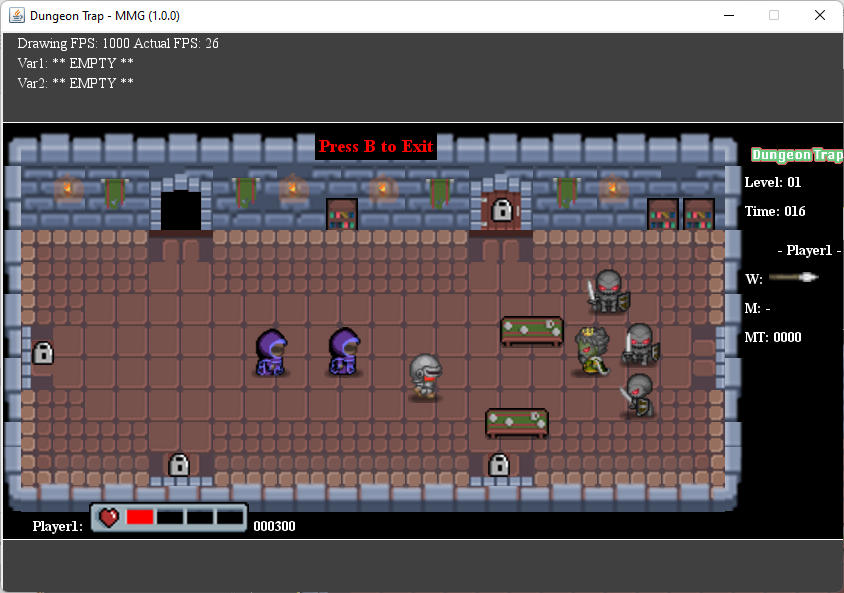
 
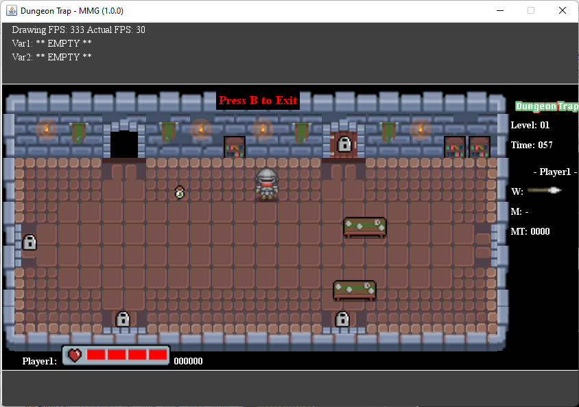

### Memory Match
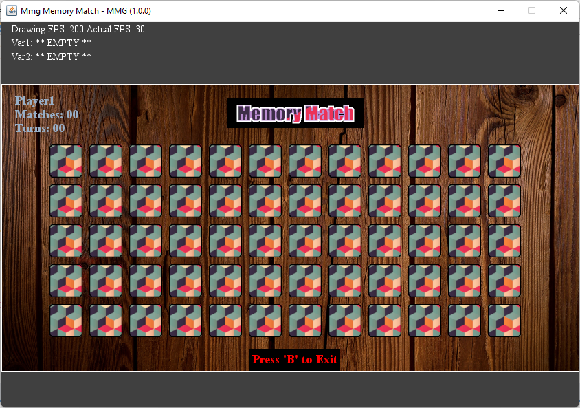
 
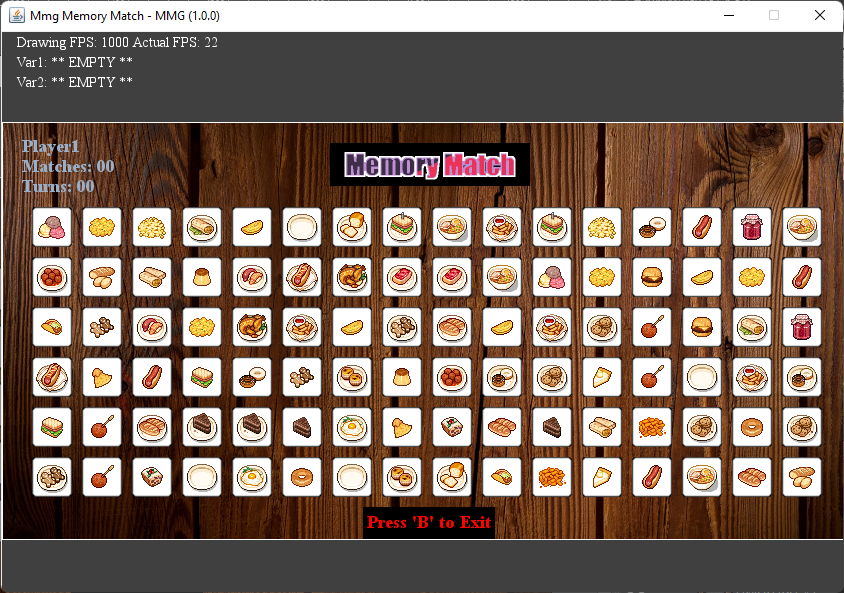
 
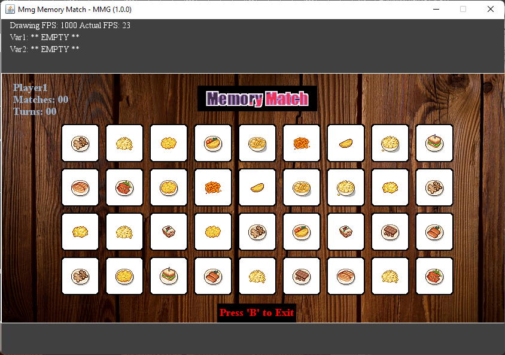

### Pong Clone
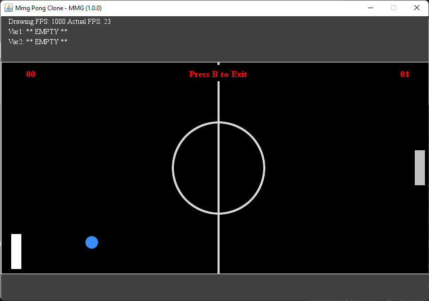
 
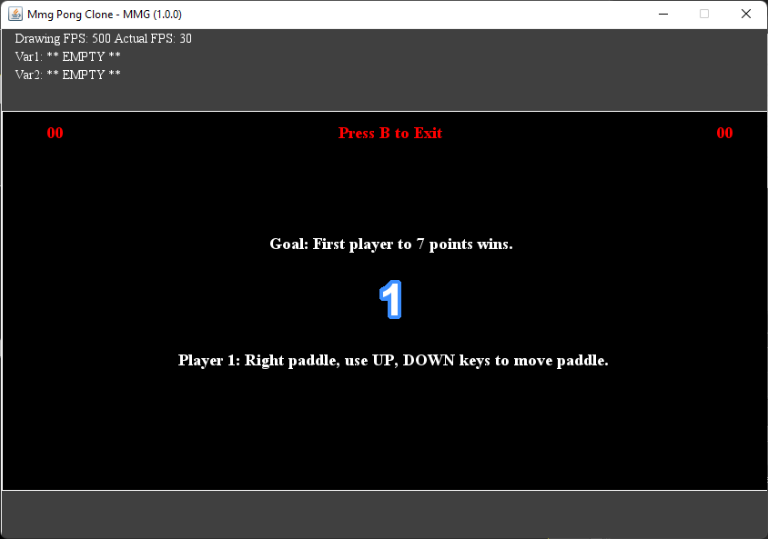
 
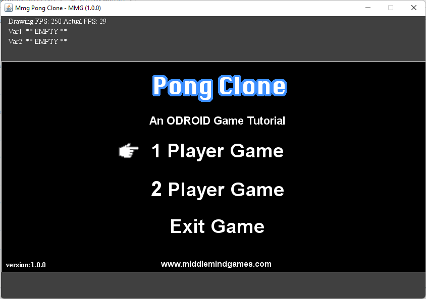

### Tyre RPG
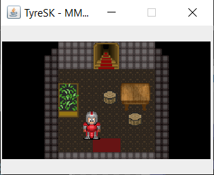
 
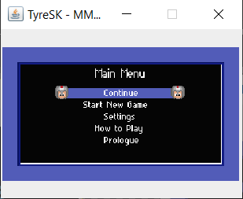

## Packages / Namespaces
<b>net.middlemind.MmgGameApiJava.MmgBase</b>
 
 
This is the lowest level API in the game engine SDK. It sits on top of the underlying framework technology. For the Java project it plugs into the Java Swing and AWT APIs. For the C# project it plugs into Monogame APIs which use OpenGL and OpenAL.
 
 
<b>net.middlemind.MmgGameApiJava.MmgCore</b>
 
 
This is the mid-level API in the game engine SDK. It sits between the low-level API, MmgBase, and the actual game implementation. It handles tasks like setting up the application window and drawing surfaces, loading resources, processing input. It also handles XML driven configuration, events, and more robust game screens.
 
 
<b>net.middlemind.MmgGameApiJava.MmgTestSpace</b>
 
 
This package represents the application level and really isn’t an SDK API. It is an example of an implementation of the SDK with runtime code included. This application, when executed, demonstrates how to use classes from the MmgBase and MmgCore APIs.

## Class Listing
<ul>
  <li>
    <b>Base Classes:</b>
     
    <ul>
      <li>MmgObj</li>
      <li>MmgColor</li>
      <li>MmgRect</li>
      <li>MmgFont</li>
      <li>MmgSound</li>
      <li>MmgPen</li>
      <li>MmgVector2</li>
      <li>MmgBmp</li>
    </ul>
  </li>
  <li>
    <b>Helper Classes:</b>
     
    <ul>
      <li>MmgApiUtils</li>
      <li>MmgHelper</li>
      <li>MmgScreenData</li>
      <li>MmgFontData</li>
      <li>MmgDebug</li>
      <li>MmgBmpScaler</li>
      <li>MmgMediaTracker</li>
    </ul>  
  </li>
  <li>
    <b>Advanced Classes:</b>
    <ul>
      <li>Mmg9Slice</li>
      <li>MmgContainer</li>
      <li>MmgLabelValuePair</li>
      <li>MmgLoadingBar</li>
      <li>MmgSprite</li>
      <li>MmgDrawableBmpSet</li>
    </ul>
  </li>

  <li>
    <b>Widget Classes:</b>
    <ul>
      <li>MmgTextField</li>
      <li>MmgTextBlock</li>
      <li>MmgScrollVert</li>
      <li>MmgScrollHor</li>
      <li>MmgScrollHorVert</li>
      <li>MmgMenuContainer</li>
      <li>MmgMenuItem</li>
    </ul>
  </li>
  <li>
    <b>Screen Classes:</b>
    <ul>
      <li>MmgSplashScreen</li>
      <li>MmgLoadingScreen</li>
      <li>MmgGameScreen</li>
    </ul>
  </li>
  <li>
    <b>Animation Classes:</b>
    <ul>
      <li>MmgPulse</li>
      <li>MmgPosTween</li>
      <li>MmgSizeTween</li>
    </ul>
  </li>
  <li>
    <b>Other Classes:</b>
    <ul>
      <li>MmgCfgFileEntry</li>
      <li>MmgEvent</li>
      <li>MmgEventHandler</li>
    </ul>
  </li>
</ul>

## Setting Up Your Environment
The code that powers this engine in two flavors Java and C#. That being said, this part only follows the Java code. All the method breakdowns are done while reviewing Java code. However, there is a complete C# implementation of the game engine and the MmgBase API is very similar between both engine versions. The next sections will show you how to setup your environment for viewing the associated projects in NetBeans, for the Java project.

### Installing the NetBeans IDE
For this section you’ll need internet access to download a copy of the IDE and the project that is associated with this book. Once you’re online and settled navigate your favorite browser to the NetBeans IDE main site, http://netbeans.org. You should see something similar to the screen shot depicted below.

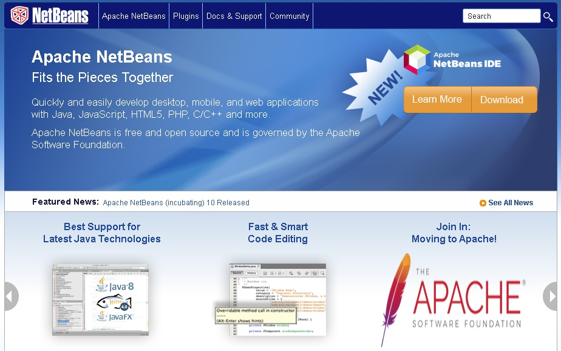

Click on the Download button in the top right-hand side of the screen and you will be brought to a list of downloads as shown below.

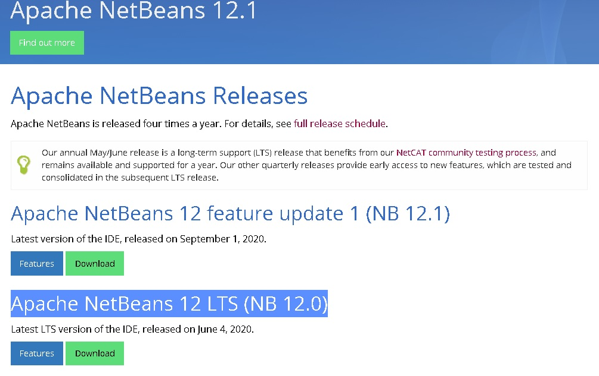

Scroll down until you see the latest LTS, long term support, entry in the list. At the time of this writing the latest LTS version is 12.1. Download and install the software. While the NetBeans IDE is installing go to this URL, http://urlforbook.com/book_java_project_download, and download the zip file for the Java version of the game engine project.

When the project file is done downloading, decompress it, and then move it to the location of your Java projects. If you are new to this and don’t have a place create a new folder in the location where you like to keep your documents. Once the IDE is finished installing and the project file is unzipped and moved to the desired location launch the NetBeans IDE. Select “File -> open Project...” from the menu. Find the location of the project folder you just downloaded and unzipped.

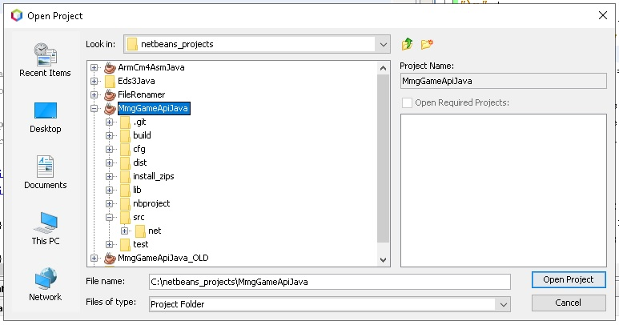

When the project is done loading, we need to check a few things. Right-click on the MmgGameApiJava project and select the Properties entry. The project setting window will popup. Select the Packaging option from the list of sections on the left-hand side of the window. You should make sure your project has the following options set in the screen shot shown below.

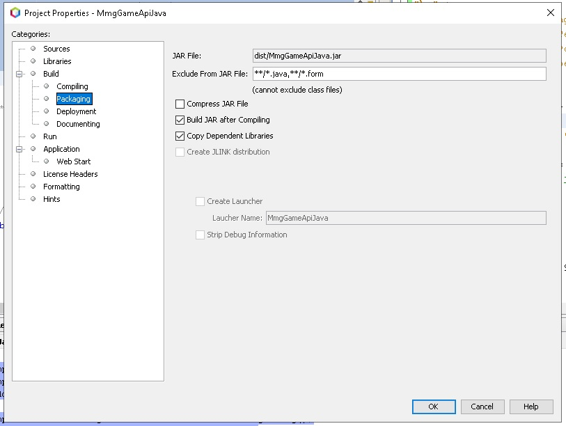

Make sure that the JAR File field at the top of the screen starts with the dist folder. Once that’s done click on the Run entry on the left-hand list of categories. We’re going to make sure that the proper run-time settings are in place.

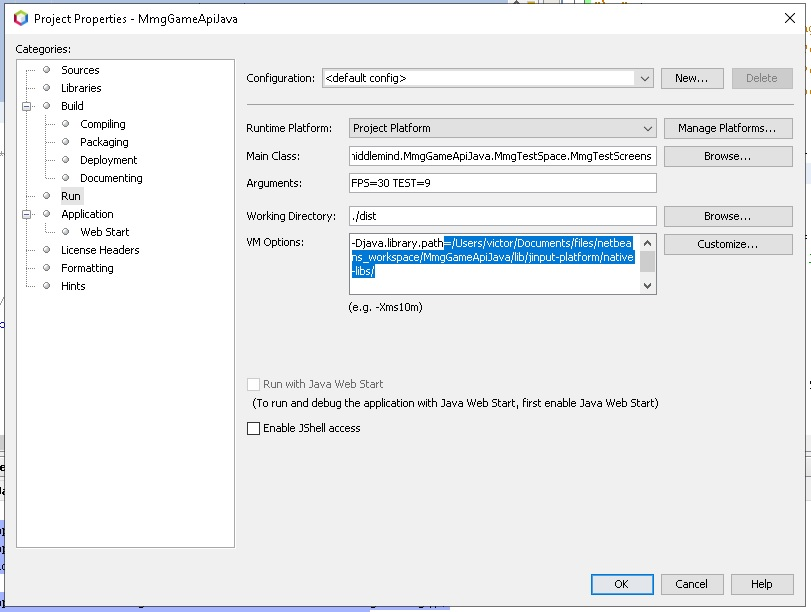

With regard to the run-time settings, you’re going to want to make sure that the main class is set, choose the MmgTestScreens class of the MmgTestSpace package. The arguments field can be left blank or you can experiment with different FPS settings. Warning, don’t set a frame rate that is higher than 60 FPS. Notice the path that is highlighted in blue in the image above. This is the path to the native libraries on my development environment. 

You should change that path to the equivalent folder in your environment. That will enable native OS library support for the game engine project. Before you can run anything, we should make sure the project can compile. Right-click on the project in the list and select the Clean and Build option as shown below.

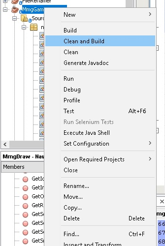

After the project compiles you should familiarize yourself with how to run the example game screens project. Find the MmgTestSpace package in the MmgGameApiJava project’s package list. Locate the MmgTestScreens file, right-click on it and select Run File as shown below.

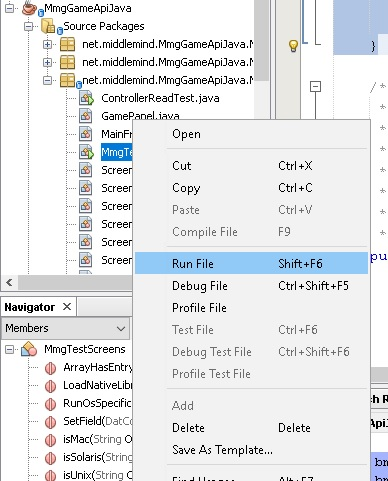

Give the application a few seconds to load up. After a short wait you should see something similar to the screen shot shown below.

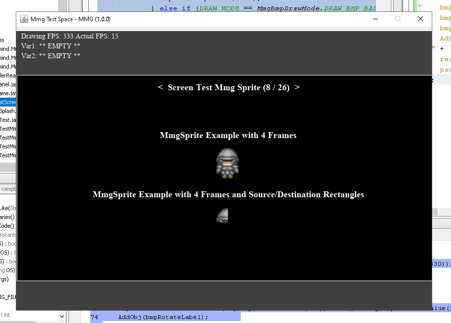

The concludes the NetBeans IDE installation and configuration process.

## About the Game Engine
This is the original game engine that was the project for the book listed above. It is a simple but fairly powerful 2D game engine and you can feel free to use it as you wish. It is great for prototyping quick games or testing out 2D game assets.

